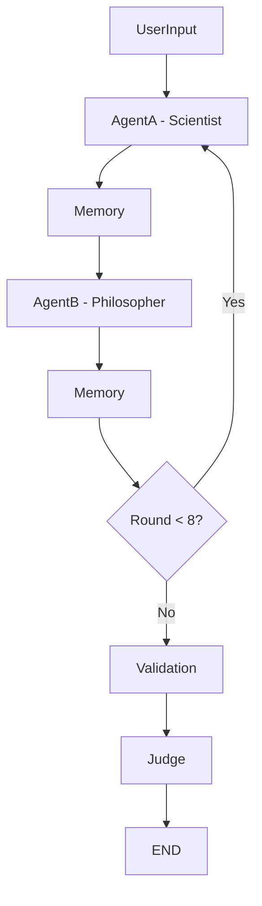

# 🧠 Multi-Agent Debate DAG using LangGraph

A sophisticated debate simulation system where two AI agents (Scientist and Philosopher) engage in structured arguments with memory management, turn control, and automated judging — all powered by a local Hugging Face model using LangGraph's DAG-based execution.

---

## 📚 Table of Contents

* [🎯 Overview](#-overview)
* [🏗️ Architecture](#-architecture)
* [🚀 Installation & Setup](#-installation--setup)
* [💻 Usage](#-usage)
* [📁 Output Files](#-output-files)
* [🔧 Technical Implementation](#-technical-implementation)
* [🎨 DAG Visualization](#-dag-visualization)
* [🔍 Key Features](#-key-features)
* [🐛 Troubleshooting](#-troubleshooting)
* [📊 Performance Considerations](#-performance-considerations)
* [🔮 Future Enhancements](#-future-enhancements)
* [📝 License](#-license)
* [🤝 Contributing](#-contributing)

---

## 🎯 Overview

This system implements a complete debate workflow using LangGraph's DAG architecture, featuring:

* **Two specialized AI agents** with distinct personas and reasoning styles
* **Memory management** that maintains debate context and history
* **Turn-based control** ensuring proper alternation between agents
* **Automated judging** with logical evaluation and winner declaration
* **Comprehensive logging** of all state transitions and arguments
* **Local LLM via Hugging Face** (`gpt2`, no API key needed)
* **CLI interface** for user interaction

---

## 🏗️ Architecture

### DAG Structure

```
UserInput → AgentA (Scientist) → Memory → AgentB (Philosopher) → Memory → ...
                ↓                                    ↓
            [8 rounds total]                   [8 rounds total]
                ↓                                    ↓
          Validation ← Memory ← AgentB ← Memory ← AgentA
                ↓
              Judge → END
```

### Node Descriptions

1. **UserInputNode**: Accepts debate topic and initializes system state
2. **AgentA (Scientist)**: Evidence-based reasoning with empirical focus
3. **AgentB (Philosopher)**: Ethical and conceptual analysis approach
4. **MemoryNode**: Maintains structured summaries of arguments
5. **ValidationNode**: Ensures debate completion (8 rounds) and coherence
6. **JudgeNode**: Evaluates arguments and declares winner with reasoning

---

## 🚀 Installation & Setup

### Prerequisites

* Python 3.8+
* Internet connection (first time only, for downloading model)

### Installation Steps

1. **Clone or Download the Project**

   ```bash
   git clone https://github.com/your-username/multi-agent-debate-dag.git
   cd multi-agent-debate-dag
   ```

2. **Install Dependencies**

   ```bash
   pip install -r requirements.txt
   ```

   Example `requirements.txt`:

   ```
   transformers
   torch
   langgraph
   rich
   ```

3. **Run the System**

   ```bash
   python debate_system.py
   ```

   No API key required!

---

## 💻 Usage

### Basic CLI Usage

```bash
python debate_system.py
```

The system will prompt:

```
Enter topic for debate:
```

Example input:

```
Should AI be regulated like medicine?
```

### Expected Output Format

```
Starting debate between Scientist and Philosopher...
Topic: Should AI be regulated like medicine?

[Round 1] Scientist: AI regulation is crucial for public safety, similar to pharmaceutical oversight...
[Round 1] Philosopher: While safety is important, excessive regulation could stifle innovation...

...

[Judge] Summary of debate:
The debate centered on balancing AI safety with innovation freedom...

[Judge] Winner: Scientist
Reason: Presented more grounded, risk-based arguments with concrete examples...
```

---

## 📁 Output Files

The system generates:

1. **`debate_log.txt`**: Full log of debate steps, state transitions, and arguments
2. **`debate_results.json`**: Structured output of final debate state
3. **Console Output**: Real-time feedback during debate execution

### Sample Log Entry

```
2025-06-27 13:44:10 - INFO - TRANSITION: user_input -> agent_a
2025-06-27 13:44:10 - INFO - STATE: Round 1, Agent: scientist
2025-06-27 13:44:13 - INFO - [Round 1] Scientist: AI systems require regulatory oversight...
```

---

## 🔧 Technical Implementation

### Language Model

This system uses Hugging Face's **GPT-2** model for local text generation:

```python
from transformers import pipeline
self.llm = pipeline("text-generation", model="gpt2")
```

You can modify parameters like:

```python
self.llm(prompt, max_new_tokens=100, temperature=0.7)
```

### Agent Personas

**Scientist**:

* Empirical, evidence-based reasoning
* Focuses on risk analysis and real-world data

**Philosopher**:

* Ethical, conceptual, and historical reasoning
* Focuses on morality, human values, and autonomy

### Memory System

* **Structured summaries** per round per agent
* **Truncation logic** to manage token length
* **Contextual prompts** passed to agents

### State Management

```python
@dataclass
class DebateState:
    topic: str
    current_round: int
    current_agent: AgentType
    arguments: List[DebateArgument]
    memory_summary: str
    is_complete: bool
    winner: Optional[str] = None
    judge_reasoning: Optional[str] = None
```

---

## 🎨 DAG Visualization

### Static Mermaid Diagram



### Optional Programmatic View

Add this to your script to visualize:

```python
debate_system.graph.get_graph().draw_mermaid()
```

---

## 🔍 Key Features

* ✅ **Turn-based debate flow** with DAG logic
* ✅ **Agent personas** simulate distinct reasoning strategies
* ✅ **Memory summaries** for context and consistency
* ✅ **Automated judge** using heuristics for final verdict
* ✅ **Local inference** with `transformers`, no API key needed
* ✅ **Structured outputs** and full logging

---

## 🐛 Troubleshooting

### Common Issues

#### 1. Model not found

```
OSError: Couldn't connect to 'https://huggingface.co' to download model...
```

✅ **Solution**: Ensure internet is available for the first run.

#### 2. CUDA Warnings

```
UserWarning: CUDA not available
```

✅ **Solution**: Safe to ignore unless using GPU.

#### 3. Repetitive or Nonsensical Output

✅ **Solution**: Tune generation settings:

```python
max_new_tokens=100, temperature=0.7, top_p=0.9
```

---

## 📊 Performance Considerations

* 🧠 **Memory truncation** avoids overflow
* ⚙️ **Efficient local inference** for small debates
* ✅ **No API usage** = fully offline after model download
* 🧪 **Output logs and JSONs** support post-analysis

---

## 🔮 Future Enhancements

* 🗣️ Support more agents (e.g., Economist, Lawyer)
* 🏛️ Add more debate formats (Oxford, Townhall, etc.)
* 🖥️ Web UI via Streamlit or FastAPI
* 🧠 Upgrade to `gpt-j`, `llama`, or `mistral` for deeper debates
* 📈 Add quality scoring and metrics for debates
* 🔄 Multi-topic batch processing

---

## 📝 License

This project is provided **as-is** for educational and demonstration purposes.
Feel free to fork and extend!

---

## 🤝 Contributing

To contribute:

1. Fork this repository
2. Create a new branch: `git checkout -b feature/your-feature`
3. Make your changes + tests
4. Submit a pull request!


