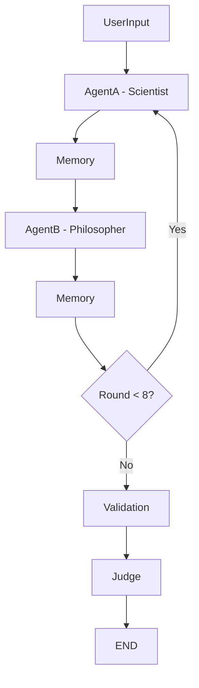

# Multi-Agent Debate DAG using LangGraph

A sophisticated debate simulation system where two AI agents (Scientist and Philosopher) engage in structured arguments with memory management, turn control, and automated judging.

## 🎯 Overview

This system implements a complete debate workflow using LangGraph's DAG architecture, featuring:
- **Two specialized AI agents** with distinct personas and reasoning styles
- **Memory management** that maintains debate context and history
- **Turn-based control** ensuring proper alternation between agents
- **Automated judging** with logical evaluation and winner declaration
- **Comprehensive logging** of all state transitions and arguments
- **CLI interface** for user interaction

## 🏗️ Architecture

### DAG Structure
```
UserInput → AgentA (Scientist) → Memory → AgentB (Philosopher) → Memory → ...
                ↓                                    ↓
            [8 rounds total]                   [8 rounds total]
                ↓                                    ↓
          Validation ← Memory ← AgentB ← Memory ← AgentA
                ↓
              Judge → END
```

### Node Descriptions

1. **UserInputNode**: Accepts debate topic and initializes system state
2. **AgentA (Scientist)**: Evidence-based reasoning with empirical focus
3. **AgentB (Philosopher)**: Ethical and conceptual analysis approach
4. **MemoryNode**: Maintains structured summaries of arguments
5. **ValidationNode**: Ensures debate completion (8 rounds) and coherence
6. **JudgeNode**: Evaluates arguments and declares winner with reasoning

## 🚀 Installation & Setup

### Prerequisites
- Python 3.8+
- OpenAI API key

### Installation Steps

1. **Clone/Download the project files**
   ```bash
   # Save the main code as debate_system.py
   # Save requirements as requirements.txt
   ```

2. **Install dependencies**
   ```bash
   pip install -r requirements.txt
   ```

3. **Set up OpenAI API key**
   ```bash
   export OPENAI_API_KEY="your-api-key-here"
   ```
   
   Or create a `.env` file:
   ```
   OPENAI_API_KEY=your-api-key-here
   ```

4. **Run the system**
   ```bash
   python debate_system.py
   ```

## 💻 Usage

### Basic Usage
```bash
python debate_system.py
```

The system will prompt you for a debate topic:
```
Enter topic for debate: Should AI be regulated like medicine?
```

### Expected Output Format
```
Starting debate between Scientist and Philosopher...
Topic: Should AI be regulated like medicine?

[Round 1] Scientist: AI regulation is crucial for public safety, similar to pharmaceutical oversight...

[Round 1] Philosopher: While safety is important, excessive regulation could stifle innovation...

[Round 2] Scientist: The potential for AI systems to cause widespread harm necessitates...

[Round 2] Philosopher: Historical precedent shows that overregulation often delays...

...

[Judge] Summary of debate:
The debate centered on balancing AI safety with innovation freedom...

[Judge] Winner: Scientist
Reason: Presented more grounded, risk-based arguments with concrete examples...
```

## 📁 Output Files

The system generates several output files:

1. **`debate_log.txt`**: Complete log of all operations, state transitions, and arguments
2. **`debate_results.json`**: Structured JSON output with final debate state
3. **Console output**: Real-time debate progress and results

### Sample Log Entry
```
2024-01-15 10:30:45 - INFO - TRANSITION: user_input -> agent_a
2024-01-15 10:30:45 - INFO - STATE: Round 1, Agent: scientist
2024-01-15 10:30:50 - INFO - [Round 1] Scientist: AI systems require regulatory oversight...
2024-01-15 10:30:50 - INFO - MEMORY UPDATE: Scientist (R1): AI systems require regulatory...
```

## 🔧 Technical Implementation

### State Management
The system uses a comprehensive `DebateState` dataclass:
```python
@dataclass
class DebateState:
    topic: str
    current_round: int
    current_agent: AgentType
    arguments: List[DebateArgument]
    memory_summary: str
    is_complete: bool
    winner: Optional[str] = None
    judge_reasoning: Optional[str] = None
```

### Agent Personas

**Scientist Agent**:
- Evidence-based reasoning
- Empirical data focus
- Risk assessment methodology
- Practical implications analysis

**Philosopher Agent**:
- Ethical and moral reasoning
- Conceptual analysis
- Historical context consideration
- Human autonomy perspectives

### Memory System
- **Structured summaries**: Maintains context without overwhelming agents
- **Truncation logic**: Prevents memory overflow while preserving recent context
- **Agent-specific filtering**: Each agent receives relevant historical context

### Validation Logic
- **Turn enforcement**: Ensures proper alternation between agents
- **Round counting**: Tracks progress toward 8-round completion
- **Argument uniqueness**: Prevents repetition through memory context
- **Coherence checking**: Maintains logical flow throughout debate

## 🎨 DAG Visualization

The system supports DAG visualization through two methods:

### Method 1: Programmatic Generation
```python
# Add to your code for visualization
debate_system.graph.get_graph().draw_mermaid()
```

### Method 2: Static Diagram


## 🔍 Key Features

### 1. Robust Turn Management
- Conditional routing ensures proper agent alternation
- State validation prevents out-of-turn speaking
- Round tracking maintains debate structure

### 2. Intelligent Memory System
- Contextual summaries for each agent
- Memory truncation prevents token overflow
- Historical context preservation

### 3. Comprehensive Logging
- All state transitions logged
- Individual arguments tracked
- Memory updates recorded
- Final judgment preserved

### 4. Automated Judging
- Multi-criteria evaluation system
- Logical coherence assessment
- Evidence strength analysis
- Clear winner declaration with reasoning

## 🐛 Troubleshooting

### Common Issues

1. **API Key Error**
   ```
   Error: OpenAI API key not found
   ```
   **Solution**: Set the `OPENAI_API_KEY` environment variable

2. **Import Errors**
   ```
   ModuleNotFoundError: No module named 'langgraph'
   ```
   **Solution**: Install requirements with `pip install -r requirements.txt`

3. **Empty Arguments**
   **Solution**: Check API key validity and network connection

### Debug Mode
Enable detailed logging by modifying the logger level:
```python
logging.basicConfig(level=logging.DEBUG)
```

## 📊 Performance Considerations

- **Token Management**: Memory system prevents token overflow
- **API Efficiency**: Structured prompts minimize API calls
- **Error Handling**: Comprehensive exception management
- **State Persistence**: JSON output preserves results

## 🔮 Future Enhancements

Potential improvements for the system:
- **Multiple debate formats** (Oxford, Parliamentary, etc.)
- **Variable round counts** (configurable debate length)
- **Additional agent personas** (Lawyer, Economist, etc.)
- **Real-time web interface** using FastAPI/Streamlit
- **Debate quality metrics** and scoring system
- **Multi-topic batch processing**

## 📝 License

This project is provided as-is for educational and demonstration purposes.

## 🤝 Contributing

To contribute to this project:
1. Fork the repository
2. Create a feature branch
3. Make your changes with tests
4. Submit a pull request

---

**Note**: This system requires a valid OpenAI API key and internet connection for the LLM calls. The debate quality depends on the underlying language model's capabilities.